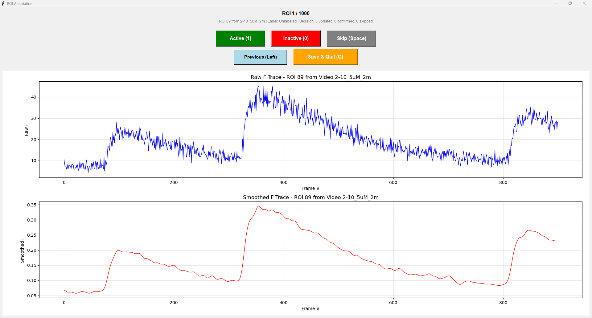
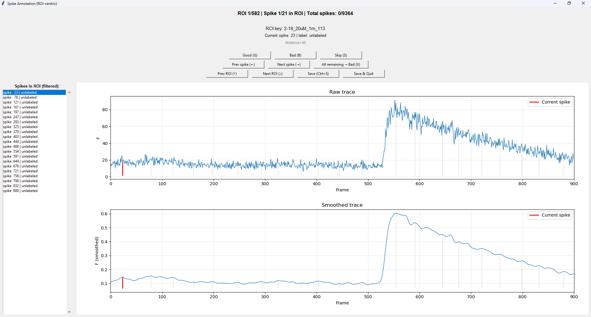

# Post Suite2p GCaMP Fluorescence Analysis in a Personalizable Workflow
This program lends a degree of lab-specific personalization to the analysis of GCaMP flourescence traces to create flexible, automated pipelines tailored to the nature of an individual lab's data. It is designed to allow the user to parse through signal noise generated by their specific video acquisition methods and to characterize experimental neuronal activity that may significantly differ from stereotyped patterns of electroactivity in endogenous neurons. Its main focus is not precises spike timing inference (like that of OASIS, Cascade, etc) but rather whole-field, population level analysis of neuronal activity. It contains 3 distinct modules that must be operated sequentially for full personalizability. As of now, it also requires the output produced by Suite2p or at least similarly organized file and data structures. 
1. The Region of Interest (ROI) Classifier Module allows a user to train a lightweight classifier on a small subset of their ROI data to isolate active, experimentally significant neurons from inactive cells or false positive cell detections. 
2. The Spike Classifier Module allows the user to train a lightweight classifier on the validity of a naively detected peak. In other words, the program will collect all local maxima of a smoothed version of the user's trace, and the user will label a portion of those peaks as valid, i.e. representative of a fluorescence event, or invalid, i.e. some noise,  drift, neuropil, etc artifact. In those fluorescence events where it seems like two proximally located peaks could represent that event, only choose the more prominent peak as valid as the model penalizes shallow prominences coupled with close proximities. The ratio of fluorescence events to peaks which represent them is necessarily $1:1$.
3. The Analysis Pipeline leverages these classifiers onto the dataset as a whole to characterize neurons and identify their discrete fluorescence events, allowing for interpretable representations of calcium decay kinetics across the field of view. It also identifies correlated fluorescence signals to describe potentially synaptically connected neurons. It aggregates these data at each level of the file directory and compares all items in a given level to provide a readily available understanding of treatment effects.
## Installation 
### Prerequisites
- Python 3.10+ 
- [Anaconda](https://www.anaconda.com/download) or [Miniconda](https://docs.conda.io/en/latest/miniconda.html)
    - During installation, its advisable to check "Add to PATH" so conda is accessible 
- [Suite2p](https://github.com/MouseLand/suite2p) output data
### Setup
First, open a command prompt or an anaconda prompt on your computer. Then,
```bash
# 1. Clone the repository (or download the zip directly from GitHub and open the main folder)
git clone https://github.com/<your-username>/GCaMP-analysis.git

# 2. Navigate to the main folder
cd GCaMP-analysis

# 3. Create a fully equipped conda environment 
conda env create -f environment.yml


# 4. Activate that environment so all the tools are available to the program
conda activate gcamp

# Optionally, if anaconda environment dependency installation is not working, run this command after activating your environment
pip install -r [requirements.txt](http://_vscodecontentref_/1)

# 5. Verify dependency installation 
python -c "import numpy, scipy, pandas, sklearn, matplotlib, joblib, yaml; print('All dependencies OK')"
```
## Workflow 
As mentioned previously, there are three modules, each of which build on the last, so they must be completed in order to fully exploit the program. 

### ROI Classifier 
The first stage comprises 3 modules: `prepare_data`, `annotate_data`, and `train_classifier`. A guided workflow is provided in jupyter notebooks, but each module's functionality can also be executed in a command terminal. 

#### 1. `prepare_data`
This module recursively searches a specified directory for Suite2p outputs and writes a dictionary containing information for every ROI found.

**Usage:**
```bash
# Process raw arrays of fluorescence data from a dataset directory
python -m roi_classifier.prepare_data --dataset_root /path/to/videos

# Get description of the module's purpose and its arguments 
python -m roi_classifier.prepare_data --help
```

**Expected Directory Structure:**

The program recursively searches `dataset_root` for any `suite2p/plane0/F.npy` files. Your data can be organized in any nested structure as long as Suite2p outputs exist somewhere within:

```
dataset_root/
├── experiment_1/
│   ├── day_1/
│   │   └── video_001/
│   │       └── suite2p/
│   │           └── plane0/
│   │               └── F.npy
│   └── day_2/
│       └── video_002/
│           └── suite2p/
│               └── plane0/
│                   └── F.npy
├── experiment_2/
│   └── suite2p/
│       └── plane0/
│           └── F.npy
└── standalone_video/
    └── suite2p/
        └── plane0/
            └── F.npy
```

The only requirement is the presence of `suite2p/plane0/F.npy` within any subdirectory.

#### 2. `annotate_data`

This module provides an interactive GUI for manually labeling ROIs as "Good" (active neurons) or "Bad" (inactive/noise). Labels are used to train the ROI classifier.

**Usage:**
```bash
# Annotate up to 100 randomly selected ROIs
python -m roi_classifier.annotate_data --data_path data/all_roi_features.npy -n 100

# Only annotate unlabeled ROIs
python -m roi_classifier.annotate_data --data_path data/all_roi_features.npy --unlabeled_only

# Get descriptions of all arguments
python -m roi_classifier.annotate_data --help
```
**GUI Controls:**

| Control | Action |
|---------|--------|
| `1` or **Active** button | Label ROI as Good (active neuron) |
| `0` or **Inactive** button | Label ROI as Bad (inactive/noise) |
| `Space` or `→` or **Skip** button | Skip ROI without labeling |
| `←` or **Previous** button | Go back to previous ROI |
| `Q` or `Esc` or **Save & Quit** button | Save progress and exit |

**GUI Display:**



**Tips:**
- Start with `--unlabeled_only` to label new ROIs
- Use `--labeled_only` to review and correct existing labels
- Progress is auto-saved at regular intervals and on exit
- Aim for at least 100-200 labeled ROIs (balanced between Good/Bad) before training

**Output:**

Updates the `.npy` file in place with:
- `label.value`: `1` (Good), `0` (Bad), or `-1` (Unlabeled)
- `label.source`: `'manual'` for human-annotated labels

#### 3. `train_classifier`

This module trains an ROI classifier using the manually labeled data from `annotate_data`. It automatically optimizes model type, feature transforms, and hyperparameters.

**Usage:**
```bash
# Train with default settings
python -m roi_classifier.train_classifier 

# Specify model name
python -m roi_classifier.train_classifier --name my_roi_model

# Specify output directory (must remember where it is stored for pipeline anlaysis)
python -m roi_classifier.train_classifier --output_dir desired/output/dir

# Quiet mode
python -m roi_classifier.train_classifier --no-verbose
```

**Tips:**
- Ensure you have at least 500+ labeled ROIs before training
- Aim for balanced classes (roughly equal Good/Bad labels)
- Review the confusion matrix to identify systematic errors
- If accuracy is low, label more ROIs and retrain

### Spike Classifier

The second stage follows the same three-step workflow as the ROI classifier, but operates on candidate fluorescence events (spikes) within good ROIs. It trains a classifier to distinguish real calcium transients from noise artifacts.

> **Prerequisite:** Complete the ROI Classifier workflow first. Only ROIs labeled as "Good" will be processed for spike detection.

#### 1. `prepare_data`

Detects candidate spikes in all good ROIs and extracts spike-level features.

**Usage:**
```bash
# Process spikes from labeled ROI data
python -m spike_classifier.prepare_data 
# Limit number of ROIs processed
python -m spike_classifier.prepare_data --max_rois 50

# Save to a different output file
python -m spike_classifier.prepare_data -o training_data/spike_filtering/spike_features.npy
```

**Output:**

Updates the `.npy` file, adding a `spikes` dictionary to each good ROI:
```python
roi_data['spikes'] = {
    spike_idx: {
        'features': {...},      # Spike features (prominence, width, etc.)
        'windows': {...},       # Window indices for visualization
        'label': {'value': -1, 'source': 'unlabeled'}
    },
    ...
}
```

---

#### 2. `annotate_spikes`

ROI-centric GUI for labeling candidate spikes as "Good" (real transient) or "Bad" (noise/artifact).

**Usage:**
```bash
# Annotate spikes across all ROIs
python -m spike_classifier.annotate_spikes 

# Limit to first 20 ROIs
python -m spike_classifier.annotate_spikes --max_rois 20

# Only annotate unlabeled spikes
python -m spike_classifier.annotate_spikes --unlabeled_only

# Review previously labeled spikes
python -m spike_classifier.annotate_spikes --labeled_only
```
**GUI Display:**



**Tips:**
- Use `X` (label remaining as bad) to quickly dismiss obvious noise ROIs
- The spike listbox lets you jump to specific spikes within an ROI
- Aim for 200-500 labeled spikes before training

---

#### 3. `train_classifier`

Trains a spike classifier using the same optimization pipeline as the ROI classifier.

**Usage:**
```bash
# Train with default settings
python -m spike_classifier.train_classifier 

# Custom name and output
python -m spike_classifier.train_classifier --output_dir spike_classifier/models --name my_spike_model

# Include auto-labeled spikes
python -m spike_classifier.train_classifier --no-manual_only
```

**Output:**

- `<name>.joblib`: Trained spike classifier
- `<name>_results.json`: Training metrics and configuration

---

### Using the Trained Classifiers

After completing both classifier workflows, you'll have:
```
models/
├── roi_classifier.joblib
└── roi_classifier_results.json
├── spike_classifier.joblib
└── spike_classifier_results.json

```

These models are used by the Analysis Pipeline (next section) to automatically filter ROIs and spikes during batch processing.

---

### Analysis Pipeline

The final stage applies the trained classifiers to process entire experiment directories, extracting spike statistics and comparing experimental conditions.

> **Prerequisites:** 
> - Trained ROI classifier (`roi_classifier/models/`)
> - Trained spike classifier (`spike_classifier/models/`)
> - Pipeline configuration file (`config/pipeline_config.yaml`)

#### Execution

**Usage:**
```bash
# Run pipeline on an experiment directory
python main.py /path/to/experiment_root

# Optionally specify the sensor type 
python main.py /path/to/experiment_root --sensor <your_sensor>

# Validate the full analysis without writing output files
python main.py /path/to/experiment_root --dry-run

# Display program purpose and argument definitions
python main.py --help
```

`--dry-run` loads the configured models and Suite2p data and performs trace
processing, ROI and spike classification, grouping, experiment aggregation,
and sibling comparisons. It prints the normal progress and summary output but
does not create or modify metrics workbooks, NumPy matrices, figures, or output
directories.
#### Directory Structure & Sibling Comparisons

The pipeline automatically compares sibling directories at each level of your experiment hierarchy. **Parallel directory structures are required** for meaningful comparisons.

**Recommended Structure:**
Note: this specific nomenclature is based on our lab's sets of experiments. The important idea is that each item, i.e. child, immediately wihtin the same folder, i.e. parent, represent the same type of group and can/should be meaningfully compared. 
```
experiment_root/
├── Treatment_A/
│   ├── Week_1/
│   │   ├── video_001/
│   │   │   └── suite2p/plane0/F.npy
│   │   └── video_002/
│   │       └── suite2p/plane0/F.npy
│   └── Week_2/
│       ├── video_003/
│       │   └── suite2p/plane0/F.npy
│       └── video_004/
│           └── suite2p/plane0/F.npy
└── Treatment_B/
    ├── Week_1/
    │   └── video_005/
    │       └── suite2p/plane0/F.npy
    └── Week_2/
        └── video_006/
            └── suite2p/plane0/F.npy
```

This structure enables comparisons:
- `Treatment_A` vs `Treatment_B` (at root level)
- `Week_1` vs `Week_2` (within each treatment)

> **Note:** Each parent folder's immediate children are compared as siblings. Name folders descriptively so comparisons are interpretable.

---

#### Output

**Per-Video Outputs** (saved in `<video>/metrics/`):
- `<video>_metrics.xlsx`: Multi-sheet workbook containing:
  - `spike_summary`: Per-neuron spike statistics (kinetics, frequency, etc.)
  - `grouping_stats`: Neuron group membership and similarity metrics
  - `bad_rois_features`: Features of ROIs classified as inactive/noise
- `<video>_corr_matrix.npy`: Pairwise neuron correlation matrix
- `<video>_dtw_matrix.npy`: Pairwise DTW distance matrix
- `<video>_corr_groups.png`: Spatial overlay of correlation-based neuron groups
- `<video>_corr_heatmap.png`: Correlation matrix heatmap
- `<video>_dtw_groups.png`: Spatial overlay of DTW-based neuron groups (if enabled)
- `<video>_dtw_heatmap.png`: DTW distance heatmap (if enabled)

Additionally, `F_minmax.npy` (min-max normalized traces) is saved into each video's `suite2p/plane0/` directory.

**Experiment-Level Outputs** (saved in `<experiment_root>/metrics/`):
- `sibling_comparisons.xlsx`: Multi-sheet Excel file with statistical comparisons at each hierarchy level

---

### Optional Longitudinal Group Tracking

After the per-video pipeline has created each recording's Suite2p masks and
metrics workbook, repeated recordings of one region can be registered and
tracked across days:

```bash
python -m gcamp_analysis.longitudinal /path/to/experiment_root --region 1-1
```

The base recording name is treated as the region identity: `1-1`,
`1-1_Day2`, and `1-1_Day10` are matched to one another, while `1-2` is kept
separate. Treatments are also processed separately. The command selects the
largest 10% of groups on the latest day by default, then writes cell-match
quality tables, group-membership histories, and a registered multi-page TIFF
overlay. See [`gcamp_analysis/longitudinal/README.md`](gcamp_analysis/longitudinal/README.md)
for options, output definitions, and quality-control requirements.
